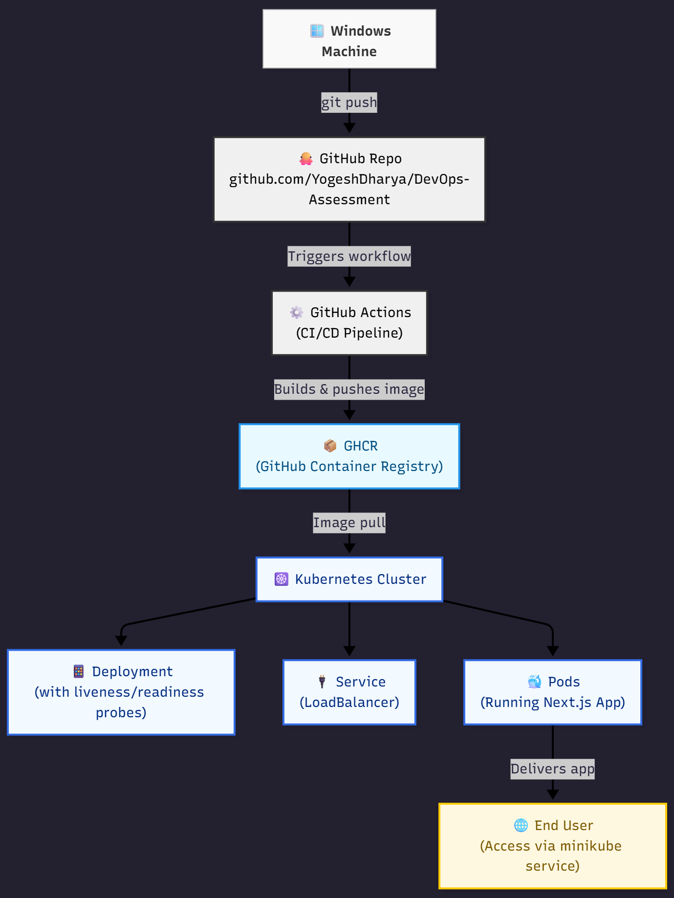
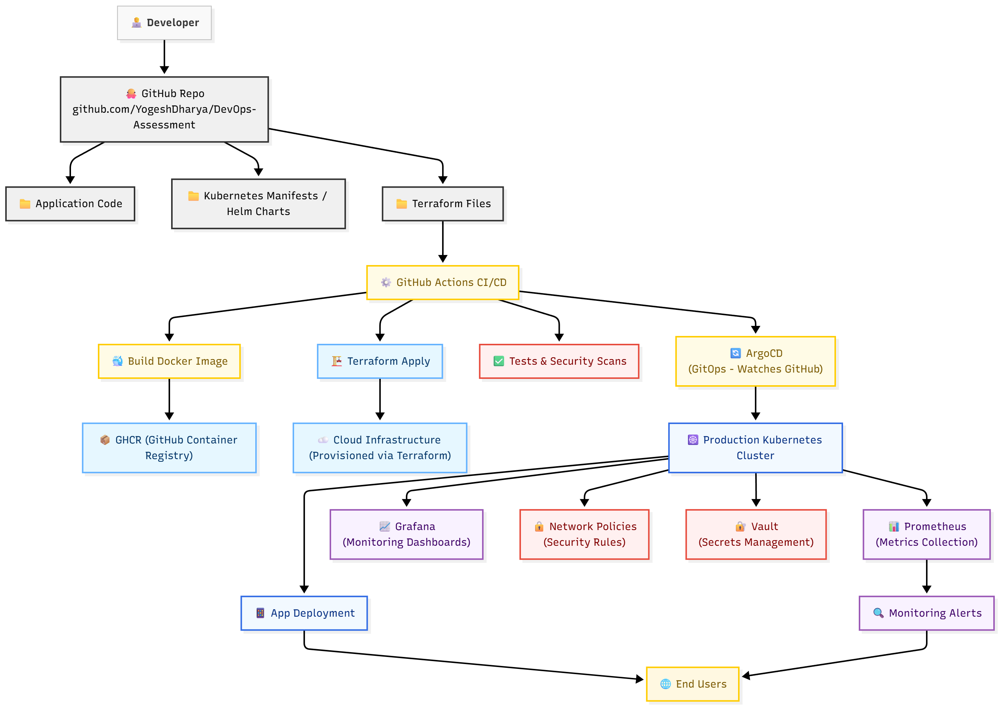

# DevOps-Assessment
A Next.js application containerized with Docker, automated with GitHub Actions, and deployed to Kubernetes.

## Features

- Next.js 14 application
- Docker containerization
- GitHub Actions CI/CD
- Kubernetes deployment
- GitHub Container Registry

## Future Improvements
Key Enhancements Shown:
GitOps: ArgoCD auto-syncing from Git

Monitoring: Prometheus + Grafana stack

Infrastructure as Code: Terraform for cloud resources

Security: Network Policies + Vault

Configuration: Helm charts for templating- **ConfigMaps & Secrets** for environment configuration

🚀 FUTURE STATE DIAGRAM (Enhanced Architecture)

